# Pokémon FRLG: Sevii Edition — 3D

A FireRed/LeafGreen-style fan game demo rendered in **3D** (HD-2D style: a
low-res voxel world with billboard pixel sprites, three.js) that runs entirely
in the browser. The adventure starts on **One Island** in the **Sevii
Islands**, right after your victory at the Pokémon League: the Seagallop ferry
drops you at the harbor pier, and Bill has asked you to visit Celio at the
Pokémon Network Center.

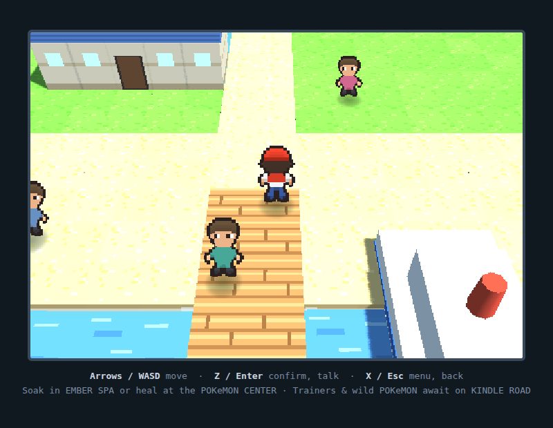

## How to play

Open `index.html` in any browser (WebGL required — any modern browser has it).
No build step, no server.

| Key | Action |
|---|---|
| Arrow keys / WASD | Move |
| Z / Enter / Space | Confirm, talk, read signs |
| X / Esc | Open menu, cancel |

## Your party

You begin with a full endgame team of six:

| Pokémon | Level | Moves |
|---|---|---|
| **Blastoise** | 60 | Surf, Ice Beam, Bite, Skull Bash |
| **Pidgeot** | 57 | Aerial Ace, Quick Attack, Return, Sand-Attack |
| **Alakazam** | 54 | Psychic, Shadow Ball, Calm Mind, Recover |
| **Snorlax** | 56 | Body Slam, Earthquake, Rest, Rock Slide |
| **Raichu** | 53 | Thunderbolt, Thunder Wave, Quick Attack, Brick Break |
| **Nidoking** | 55 | Earthquake, Sludge Bomb, Megahorn, Thunderbolt |

## One Island, like the real thing

Laid out after FRLG's One Island, from south to north:

- **Seagallop harbor** — you arrive on the pier, ferry docked alongside
- **Treasure Beach** — item balls washed up in the sand (grab them!)
- **One Island town** — the Pokémon Network Center (nurse heals, Celio tinkers
  with his machine), houses, and islanders to talk to
- **Kindle Road** — tall grass with wild Spearow, Ponyta, Meowth, Geodude, and
  rare Fearow and Rapidash (Lv. 29–37), plus two trainers with pre-battle
  banter, defeat quotes, and post-battle grudges: Bird Keeper Milo and
  Camper Rick (ask him about his tent)
- **Ember Spa** — a hot spring at the foot of the mountain that fully heals
  your party, just like the real one
- **Mt. Ember** — smoking on the horizon, and now climbable: Celio's quest
  opens the summit trail (lava pools, high-level wilds, and Cooltrainer Atlas
  guarding the Ruby)

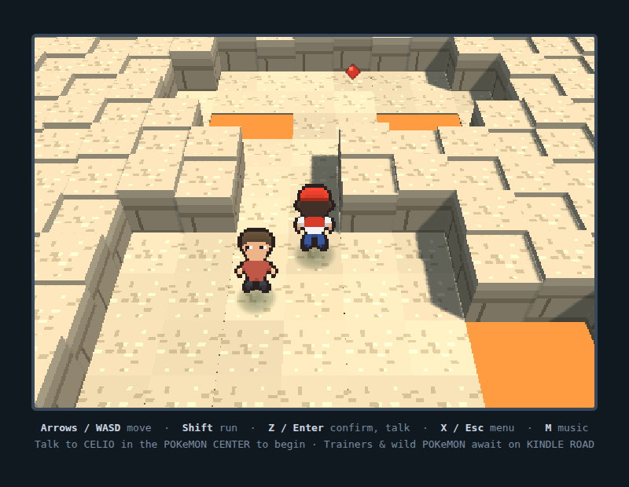

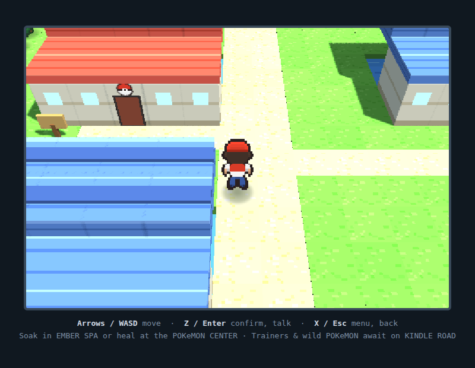
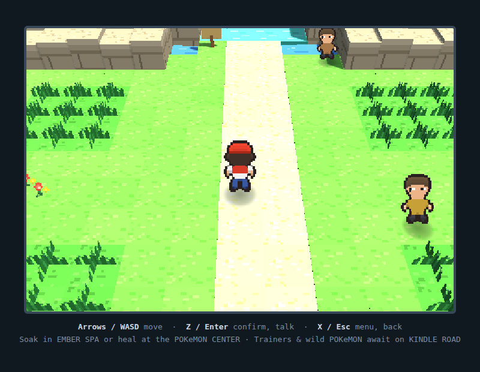
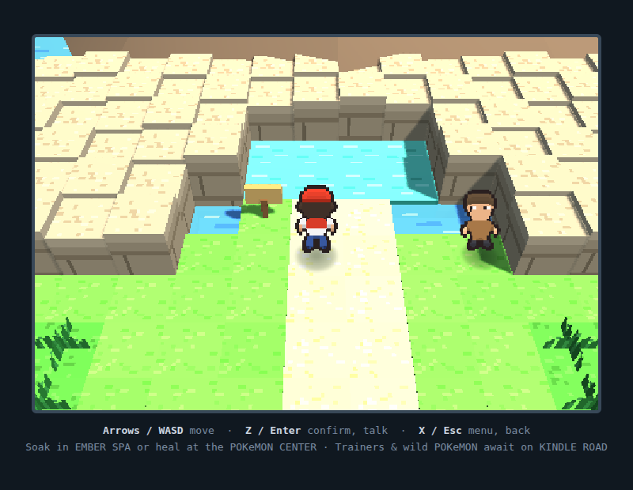

## The Ruby quest

Talk to **Celio** in the Network Center to begin: his machine needs a Ruby
from Mt. Ember's summit. Beat Atlas, grab the gem, bring it back — the machine
hums to life, you earn a **Master Ball**, and the credits roll (then keep
exploring in the postgame).

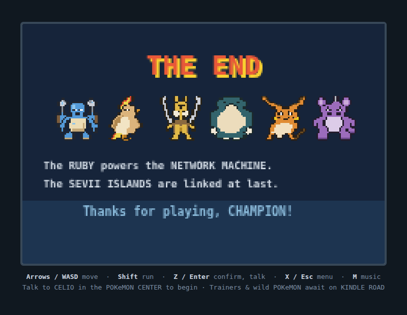

## Post-League save file

The whole game plays like picking up a completed cartridge:

- **Handheld console shell** around the screen — working D-pad, A/B, START,
  SELECT, and RUN buttons (mouse and touch), so it plays on a phone too
- **CONTINUE screen** on the title with your player, play time, Pokédex count,
  badges, and lead Pokémon
- **Trainer Card** (start menu → CHAMPION) with ID, money, play time, and all
  eight Kanto badges
- **Pokédex** with seen/owned tracking across the island's twelve species
- **Prize money** from trainers, gender icons on every Pokémon, and a spiral
  wipe into battles

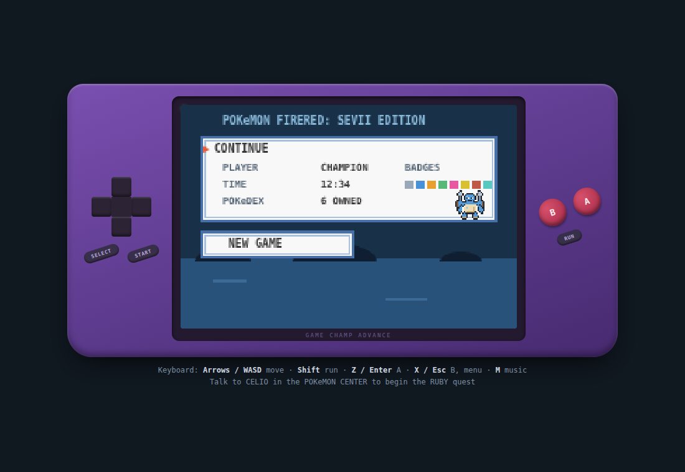
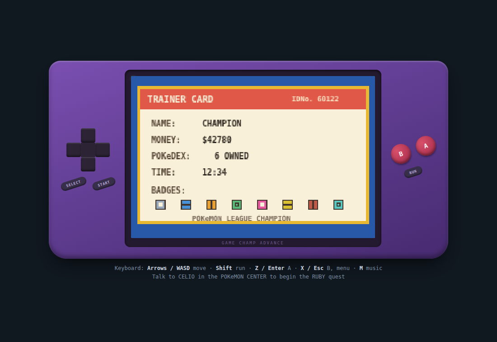
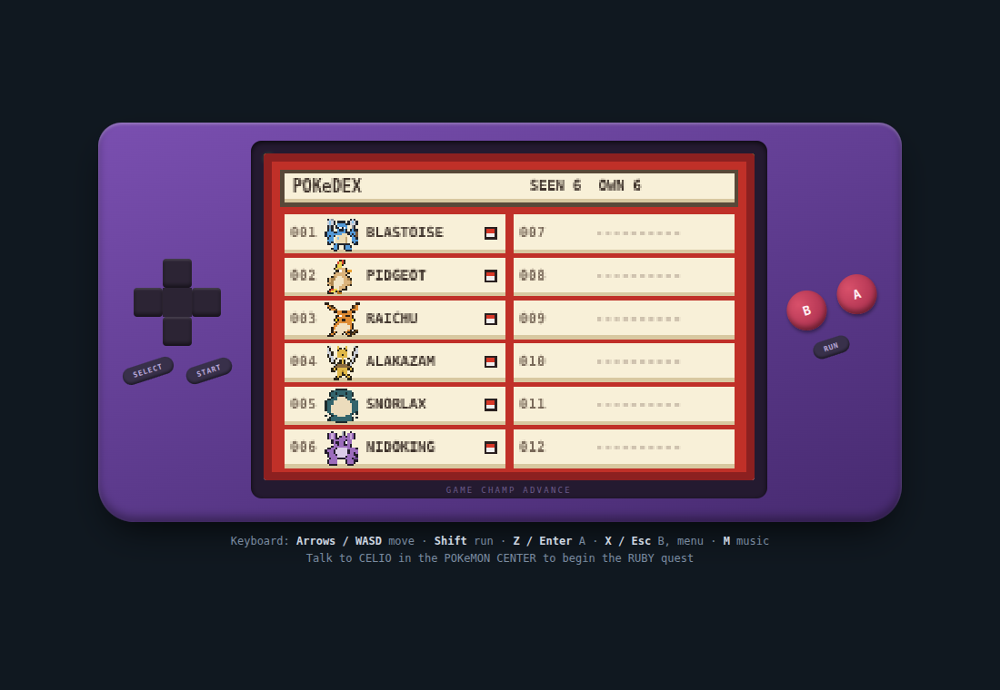

## GBA-remake modern feel

The polish layer that separates the remake era from the originals:

- **Location banners** slide in as you cross between Seagallop Harbor,
  Treasure Beach, One Island, Kindle Road, Ember Spa, and the summit
- **Colored keywords** in dialogue — places, people/Pokémon, and items each
  get their own highlight color
- **"Previously on your adventure..."** journal recap whenever you CONTINUE
- **VS Seeker** in your bag — defeated trainers accept rematches with teams
  that come back 4 levels stronger (and pay bigger prizes) every time
- **Second conversations** — talk to islanders twice for new material
- **Type-colored chips** on the move-select screen
- Soft rounded corners on every UI frame

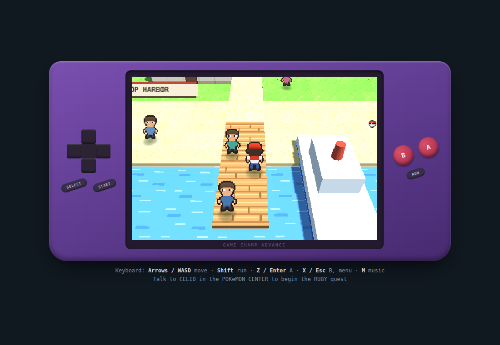
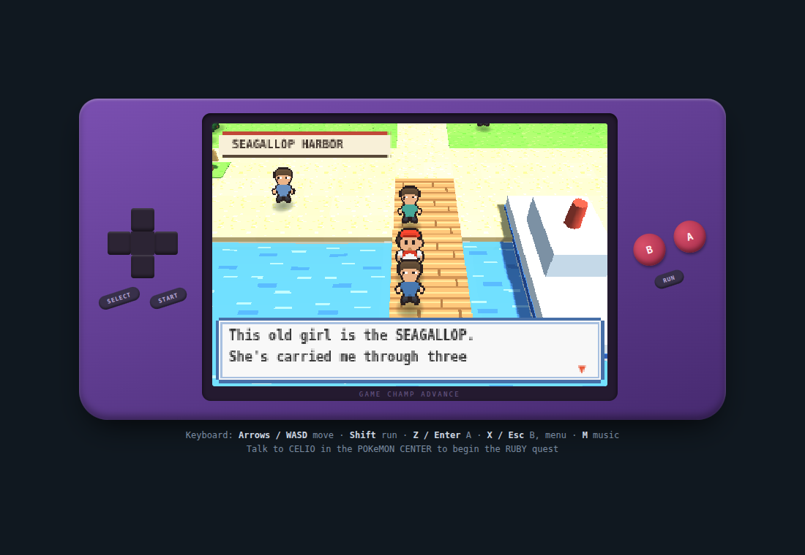

## Music & feel

- Original **chiptune soundtrack** synthesized live with WebAudio — overworld,
  interior, summit, battle, and victory themes (press **M** to mute)
- HP and EXP bars **drain and fill smoothly**, with a low-HP warning chirp
- Hold **Shift** to run

## Battles

3D arena with billboard sprites, Mt. Ember in the backdrop, and the classic
GBA UI on top:

- Gen-3 mechanics: physical/special split by move type, STAB, type chart,
  critical hits, stat stages, priority moves, status conditions
- **Trainer battles** — multi-Pokémon teams, no running, no catching
  ("Don't be a thief!")
- **Catching** wild Pokémon with the Gen 3 capture formula — caught Pokémon
  go to Bill's PC (your party is full)
- EXP and level-ups

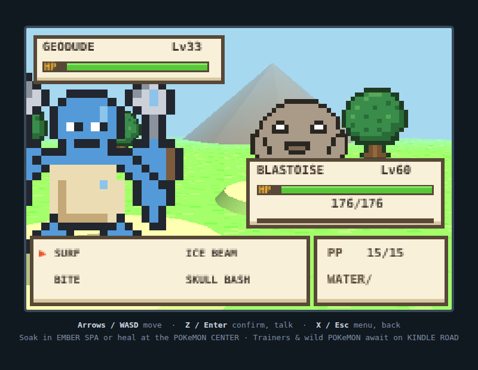

All twelve Pokémon are hand-drawn 24×24 outlined pixel sprites:

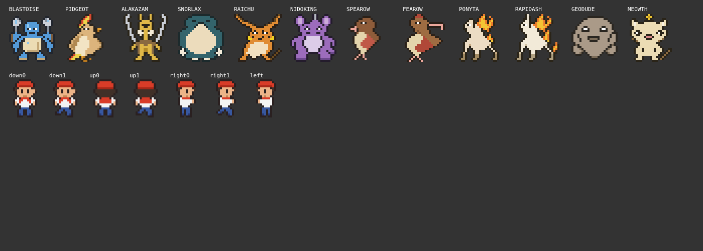

## Project layout

- `index.html` — page shell; WebGL canvas + transparent 2D UI canvas stacked
- `lib/three.min.js` — vendored three.js (r147)
- `data.js` — type chart, moves, species, party/wild/trainer tables, pixel-art
  sprites, tile maps
- `render3d.js` — HD-2D renderer: instanced voxel terrain, billboard sprites,
  animated sea, volcano smoke, battle arena
- `game.js` — game logic: movement, dialog, menus, battle state machine,
  save/load (localStorage)

Save via Menu → SAVE; the title screen offers CONTINUE when a save exists.

This is a non-commercial fan demo for educational purposes. Pokémon and all
related names are trademarks of Nintendo / Creatures Inc. / GAME FREAK inc.
