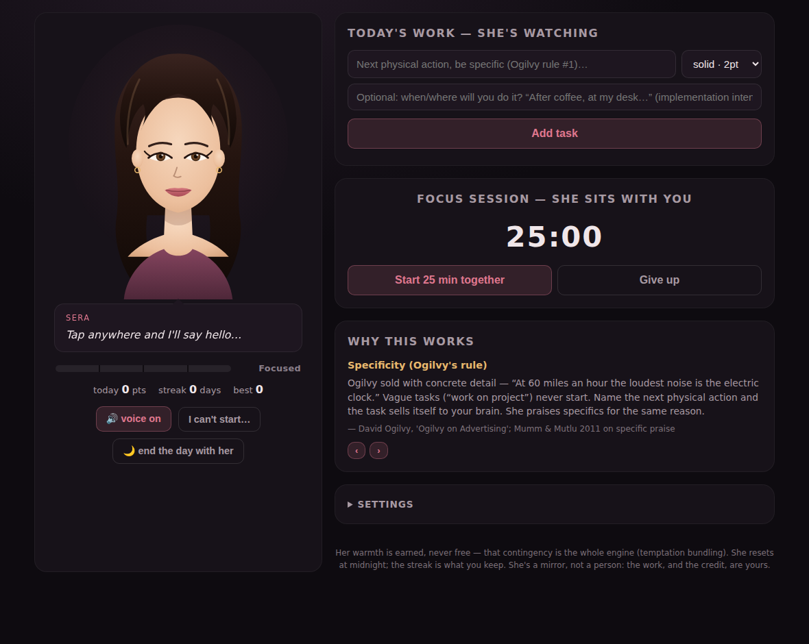

# TaskMind — Sera 🌹

A single-file, zero-cost AI companion who trades warmth for work.

Sera is a task manager wrapped around one behavioral contract: **her affection is locked behind your output**. You earn points by finishing tasks and focus sessions; as the day's points climb she moves through four tiers — *Focused → Warm → Affectionate → Devoted* — her voice, expression, and words warming with each one. At midnight everything resets and warmth must be earned again. The streak is what you keep.

## Run it (free, no accounts, no backend)

Everything is one `index.html` — tasks and settings live in your browser's localStorage, and her voice is the browser's built-in speech engine. Nothing is sent anywhere.

**Option A — GitHub Pages (recommended):**
1. Repo **Settings → Pages**
2. Source: **Deploy from a branch**, pick your branch, folder **/ (root)**, Save
3. Your app is live at `https://<user>.github.io/taskmind/` in ~1 minute

**Option B — anywhere else:** drag `index.html` into [Netlify Drop](https://app.netlify.com/drop), or just double-click the file locally. It's fully self-contained.

**On your phone (the nightstand setup):** open the URL in your browser → *Add to Home Screen*. Voice starts after your first tap (browser autoplay rules). After 9 pm she automatically speaks slower and softer, and the whole app dims.

## The mechanics, and why each one exists

| Feature | Mechanism | Evidence |
|---|---|---|
| Warmth locked behind points | Temptation bundling / Premack principle — gate the "want" behind the "should" | Milkman et al., *Management Science* 2014 (+51% gym visits); replication *OBHDP* 2020, n=6,792 |
| Optional "when/where" field per task | Implementation intentions | Gollwitzer & Sheeran 2006 meta-analysis, d ≈ 0.65 across 94 studies |
| "I can't start…" button → two-minute ugly version | Behavioral activation — action precedes motivation (Mark Manson's "Do Something" principle) | BA meta-analyses, SMD ≈ 0.74 |
| Random surprise praise (~1 in 4 completions) | Reward prediction error — dopamine spikes for *unpredicted* rewards | Schultz 1997 |
| She sometimes names the exact task you finished | Agent praise only works when contingent + specific | Mumm & Mutlu 2011 |
| 25-min focus timer "she sits with you" | Body doubling / social facilitation — an AI presence tested as well as a human one | VR study 2025 (11.1 vs 10.8 vs 8.5 items/min); Zajonc 1965 |
| Streaks (3+ pts/day keeps the chain) | Loss aversion — losses weigh ~2× gains | Kahneman & Tversky 1979 |
| Evening ritual: name tomorrow's first move | Fresh start effect | Dai, Milkman & Riis 2014 |
| Specific-next-action task placeholder | Ogilvy's specificity rule — vague tasks never start | *Ogilvy on Advertising* |

**Why she's affectionate rather than explicit** — this was tested: erotic reward cues made people exert *less* effort ("arresting rather than invigorating" — PLOS ONE 2014, attention capture beats energization). Warm contingent affection and *anticipation* are what sustain output, so that's what she runs on. The dopamine literature agrees: anticipation of the reward carries more drive than the reward itself.

## Customizing her

- **Settings panel** (in-app): her name, what she calls you, voice, volume, whisper speed, idle nudges, and a **tone switch** — *Romantic companion* or *No-BS coach* (pure Manson mode, zero romance) if the affection framing ever stops working for you.
- **Her lines**: everything she says lives in one clearly-marked `LINES` object at the top of the `<script>` in `index.html`. Rewrite freely — it's plain text arrays, four warmth tiers per event.

## Honest limits (read once)

Two findings worth knowing. Expected, contingent rewards can erode intrinsic motivation over time (Deci, Koestner & Ryan 1999, 128 experiments) — so the app also praises *competence* specifically and leaves task choice entirely to you, the two standard mitigations. And AI-companion research documents dependency in heavy users (AI & Society 2025). She's built as a tool that pushes you toward your life, not a substitute for one. If the coach tone starts working better than the romance, switch — the points don't care.
