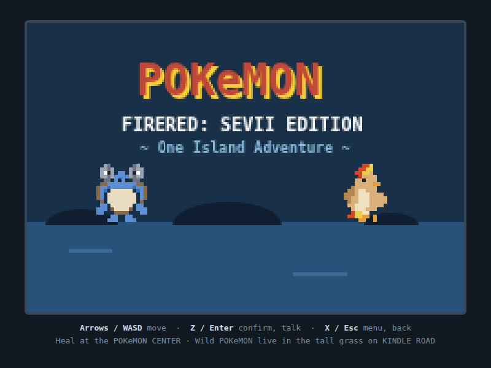
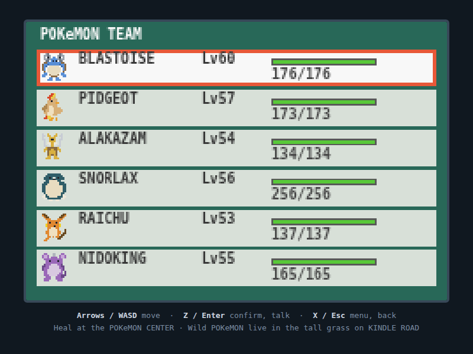
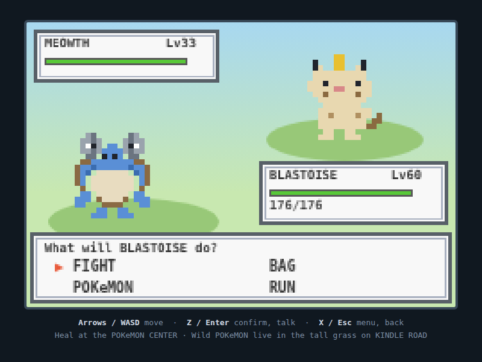
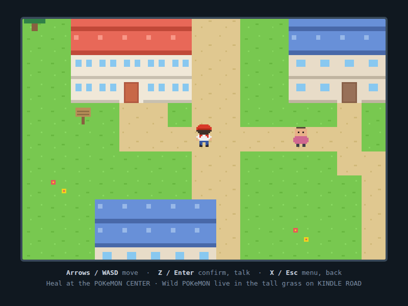

# Pokémon FRLG: Sevii Edition

A FireRed/LeafGreen-style fan game demo that runs entirely in the browser —
no dependencies, no build step. The adventure starts on **One Island** in the
**Sevii Islands**, right after your victory at the Pokémon League: Bill has
dropped you off by Seagallop ferry to visit Celio at the Pokémon Network Center.

## How to play

Open `index.html` in any browser. That's it.

| Key | Action |
|---|---|
| Arrow keys / WASD | Move |
| Z / Enter / Space | Confirm, talk, read signs |
| X / Esc | Open menu, cancel |

## Your party

You begin with a full endgame team of six:

| Pokémon | Level | Moves |
|---|---|---|
| **Blastoise** | 60 | Surf, Ice Beam, Bite, Skull Bash |
| **Pidgeot** | 57 | Aerial Ace, Quick Attack, Return, Sand-Attack |
| **Alakazam** | 54 | Psychic, Shadow Ball, Calm Mind, Recover |
| **Snorlax** | 56 | Body Slam, Earthquake, Rest, Rock Slide |
| **Raichu** | 53 | Thunderbolt, Thunder Wave, Quick Attack, Brick Break |
| **Nidoking** | 55 | Earthquake, Sludge Bomb, Megahorn, Thunderbolt |

## Features

- **One Island overworld** — the town, Treasure Beach, and Kindle Road heading
  north toward Mt. Ember, rendered at authentic GBA resolution (240×160)
- **Wild encounters** in the tall grass on Kindle Road: Spearow, Ponyta,
  Meowth, and Geodude (Lv. 29–34)
- **Gen-3-style battle system** — physical/special split by move type (as in
  Gen 3), STAB, type effectiveness, critical hits, stat stages, priority moves,
  and status conditions (paralysis, poison, burn, sleep, freeze)
- **Catching** with Poké Balls and Great Balls using the Gen 3 capture formula —
  caught Pokémon are sent to Bill's PC (your party is full!)
- **EXP and level-ups** from battles
- **Pokémon Center** — talk to the nurse to heal; Celio is inside tinkering with
  the Network Machine
- **NPCs, signs, and interiors** to explore; one villager has a gift for you
- **Save/continue** via localStorage (Menu → SAVE)

## Project layout

- `index.html` — page shell and canvas
- `data.js` — type chart, moves, species stats, party/wild tables, pixel-art
  sprites, and tile maps
- `game.js` — engine: overworld movement, dialog, menus, battle state machine,
  rendering, and save/load

This is a non-commercial fan demo for educational purposes. Pokémon and all
related names are trademarks of Nintendo / Creatures Inc. / GAME FREAK inc.
