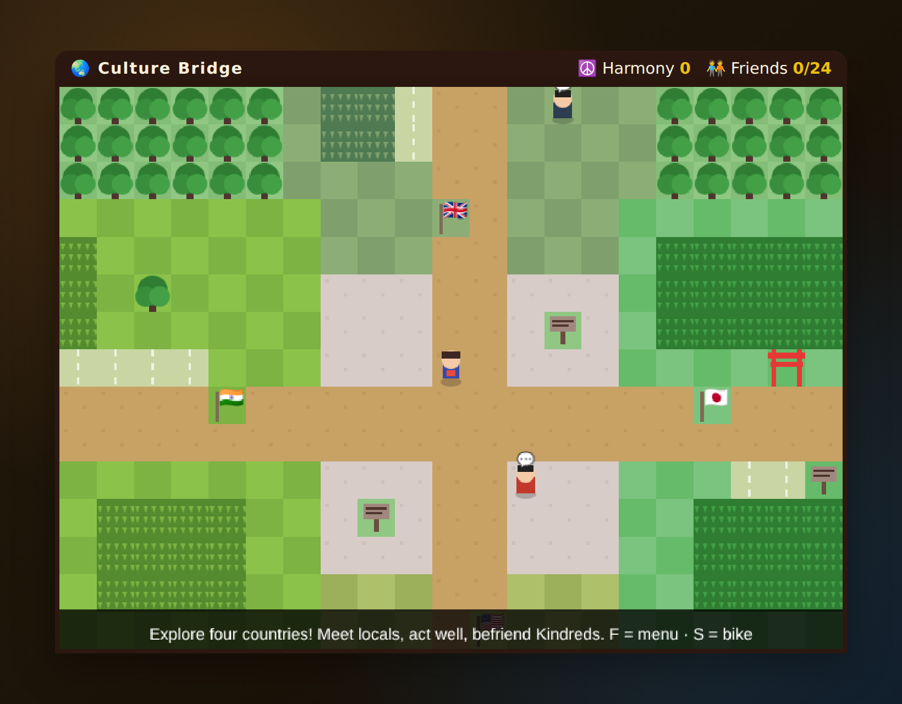

# 🌏 Culture Bridge — a world-travel adventure

A top-down travel game across four cultures — **India**, **Japan**, the **USA**
and the **UK (London)**. You don't get quizzed; you **play**. Wander each
country, meet the locals, and **choose how to act** — bow or shake hands, tip or
don't, queue or push in, buy a round or just your own. The locals react like
real people would, so you pick up the **dos and don'ts by consequence**. Behave
well and folklore companions called **Kindreds** befriend you.

The cultural learning is a **by-product of playing**: every interaction quietly
notes what you learned in your **Journal**, stamps your **Passport**, and raises
your **rapport** with that country.

> The collectible "Kindreds" are original folklore companions — nothing to do
> with any other game's "Pals" or "-mon".

No build step, no dependencies, no network. Just open it and play.



## 🚀 Play it

**Online (free hosting):** once this lives in its own public repo (e.g.
`culture-bridge`), it is published with **GitHub Pages** at

> **https://githubthebub.github.io/culture-bridge/**

Every push to the default branch redeploys it automatically via the workflow in
`.github/workflows/deploy-pages.yml` — GitHub Pages is free for public repos, so
there are no hosting fees. (See *Publishing* below for the one-time setup.)

**Locally — no server needed:** the game is a fully self-contained static site
(plain `<script>` tags, no modules, no network), so you can simply
**double-click `index.html`** to open it in any browser. It works offline. If a
browser restricts `file://` access, serve the folder instead:

```bash
# from the project root
python3 -m http.server 8000
# then visit http://localhost:8000
```

### Controls

| Action | Keys |
| --- | --- |
| Move forward / left / right | **W** / **A** / **D** |
| Move down (and all directions) | **Arrow keys** |
| Talk to a local, read a sign | **Space** |
| Choose an action in a scene | **1–4** (or click) |
| Open the **Menu** | **F** or **Enter** |
| **Bicycle** on/off (on 🚲 cycle paths) | **S** |
| Quick-open Friends / Phrasebook / Business / Journal | **C** / **P** / **B** / **J** |

On phones and tablets an on-screen D-pad plus **Talk**, **Menu** and **🚲**
buttons appear automatically.

## 🎯 How it plays

Four roads lead out from a central crossroads — **India (west)**, **Japan
(east)**, **London (north)** and the **USA (south)**. Gateway flags and passport
stamps make it obvious where you're going.

1. **Explore** a country (bike the cycle paths to go faster) and wander into the
   tall grass or up to a local.
2. A **situation** plays out — a Tokyo shopkeeper bows, a New York colleague puts
   out their hand, a London bus queue forms. You **choose how to act**.
3. The local **reacts** the way a real person would. Bow back in Japan and you
   make a friend; hug a stranger and they recoil (gently and a bit
   comically — nothing is punished harshly). A watching **Kindred** is charmed by
   good manners and befriends you.
4. Whatever you chose, the custom is noted in your **Journal**, your **rapport**
   with that country rises, and your **Passport** fills up. Befriend all 24
   Kindreds to become a **Culture Bridge Master**.

Because you learn by *doing and seeing the reaction*, the etiquette sticks the
way it does when you actually travel.

### What you pick up along the way

- **Greetings** — bow (Japan), Namaste (India), firm handshake (USA), reserved
  handshake + weather chat (UK); when a hug is fine and when it isn't.
- **Dining & tipping** — 18–20% in the US, ~10–12.5% in the UK, *none* in Japan,
  right-hand eating in India, chopstick taboos.
- **Everyday manners** — queue in London, remove your shoes in India/Japan, read
  British understatement, buy your round at the pub.
- **Doing business** — business cards in Tokyo, relationship-first deals in
  Delhi, directness in New York — deepened in the **Business Guide** (menu).

## 🐉 The 24 Kindreds

Original folklore companions you befriend, one set per country.

| 🇮🇳 India | 🇯🇵 Japan | 🇺🇸 USA | 🇬🇧 UK |
| --- | --- | --- | --- |
| 🦅 Garuda | 🦊 Kitsune | 🌩️ Thunderbird | 🦕 Nessie |
| 🐍 Naga | 🦝 Tanuki | 🐇 Jackalope | 🦄 Unicorn |
| 🐘 Airavata | 🐢 Kappa | 👣 Sasquatch | 🐲 Welsh Dragon |
| 🦢 Hamsa | 👺 Tengu | 🦋 Mothman | 🧚 Cornish Pixie |
| 🐊 Makara | 🐉 Ryu | 🐃 Babe the Blue Ox | 🌿 Green Man |
| 🐂 Nandi | 🌙 Baku | 🦫 Groundhog | 🐺 Black Shuck |

## 📖 The Menu — Friends, Passport, Journal & more

Press **F** (or **Enter**) any time for the Menu:

- **🧑‍🤝‍🧑 Friends** — the Kindreds you've befriended (and hints for the rest).
- **🛂 Passport** — which countries you've visited and your rapport with each.
- **📖 Journal** — every custom you've discovered, grouped by country. This fills
  itself as you play — the record of what you learned by doing.
- **🗣️ Phrasebook** — everyday & business phrases side by side across all four
  cultures, with native scripts for Hindi (Devanagari) and Japanese (kana/kanji),
  and the natural register for US vs. UK English (a polite "no": *Nahin* ·
  *Chotto…* · "No, I'll pass" · "I'm not sure that works").
- **💼 Business Guide** — a per-culture cheat sheet of deal-making etiquette:
  greetings, hierarchy, communication style, negotiation, punctuality, tipping.

## 🌐 Publishing (one-time setup)

The included workflow deploys to GitHub Pages automatically. To turn Pages on
the first time, pick whichever is easier:

- **Easiest — merge to the default branch.** When this branch's PR merges into
  `main`, the deploy workflow runs and (thanks to `enablement: true`) switches
  Pages on for you. Give it a minute, then open the URL above.
- **Or enable it by hand:** repo **Settings → Pages → Build and deployment →
  Source: GitHub Actions**. Then run the workflow once from the **Actions** tab
  (*Deploy Culture Bridge to GitHub Pages → Run workflow*).

Because the whole game is a static site, it also drops cleanly onto any other
free static host if you ever want an alternative — e.g. **Cloudflare Pages**,
**Netlify** (drag-and-drop the folder), **Vercel**, **Surge**, or **itch.io**.
No server-side code, no database, nothing to pay for.

## 🛠️ Project structure

```
index.html                          Title screen, HUD, overlays, touch controls
css/style.css                       Per-culture retro-game palette (warm/cool/temperate/prairie)
js/data.js                          Content — 24 Kindreds, interaction SCENES, phrasebook, guide
js/game.js                          Engine — 4-region world, movement, bike, scenes, menu, passport
.github/workflows/deploy-pages.yml  Free GitHub Pages deploy on every push to main
```

The overworld is rendered on a `<canvas>`; dialogue, scenes and the menu are
lightweight HTML overlays. Everything is procedurally drawn, so there are no
image assets to load. Progress (friends, passport, rapport, journal) is saved to
`localStorage`.

## 🌱 Extending the game

- Add a companion: append to `KINDREDS` in `js/data.js` (and an emoji in
  `KINDRED_EMOJI` in `js/game.js`).
- Add a situation: append to the right culture in `SCENES` in `js/data.js` — give
  each action a `good` flag, a `reaction`, and the `tip` it teaches.
- Add a phrase or business tip: append to `PHRASEBOOK` / `BUSINESS_GUIDE`.
- Reshape the world (regions, cycle paths, flags): edit `buildWorld()` in
  `js/game.js`.

---

*Learn the world by living in it.* 🌏 Namaste · こんにちは · Howdy · Alright, mate?
